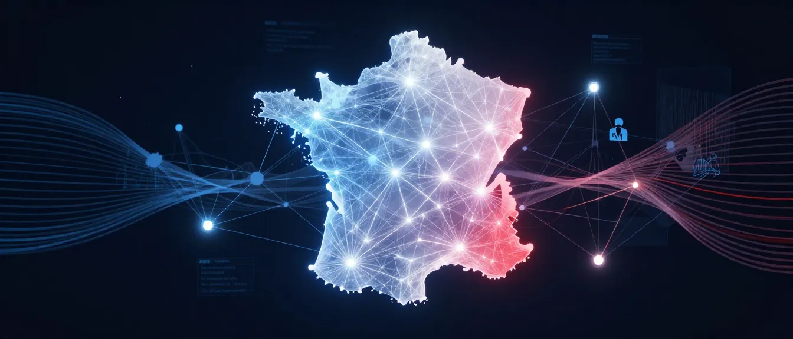

<p align="center">
  
</p>

<h1 align="center">Grand Débat National GraphRAG</h1>

<p align="center">
  <strong>Explorez les voix citoyennes à travers un graphe de connaissances 3D interactif</strong>
</p>

<p align="center">
  <em>« La voix des citoyens, visualisée »</em>
</p>

<p align="center">
  <a href="https://nextjs.org">
    
  </a>
  <a href="https://react.dev">
    
  </a>
  <a href="https://www.typescriptlang.org">
    
  </a>
</p>

<p align="center">
  Explorez les <em>Cahiers de Doléances</em> du Grand Débat National 2019 — contributions citoyennes de 50 communes de Charente-Maritime.
</p>

---

## Qu'est-ce que c'est ?

Début 2019, la France a lancé le **Grand Débat National** — une consultation nationale sans précédent où les citoyens pouvaient exprimer leurs préoccupations, leurs espoirs et leurs propositions pour l'avenir de la République. Cette interface redonne vie à ces voix.

Explorez les *Cahiers de Doléances* à travers un graphe de connaissances 3D interactif. Posez des questions en langage naturel et observez comment les thèmes civiques, les préoccupations et les propositions émergent — connectés entre les communes, révélant les motifs de ce qui compte vraiment pour les citoyens.

**Interface mono-source** : Se connecte exclusivement au serveur MCP du Grand Débat National. Aucune autre source de données.

**Source des données** :
- **Serveur MCP** : `https://graphragmcp-production.up.railway.app/mcp`
- **Jeu de données** : Cahiers de Doléances 2019
- **Couverture** : 50 communes de Charente-Maritime
- **Entités** : ~8 000+ extraites des contributions citoyennes

## Fonctionnalités

| Fonctionnalité | Description |
|----------------|-------------|
| Requête civique | Posez des questions sur les préoccupations, propositions et thèmes citoyens |
| Graphe 3D force-directed | Visualisation interactive des entités civiques et leurs relations |
| Attribution par commune | Chaque réponse traçable jusqu'à la commune source et au texte citoyen |
| Analyse inter-communes | Comparez les thèmes et préoccupations à travers les 50 communes |
| Responsive mobile | Fonctionne sur ordinateur, tablette et mobile |

## Exemples de requêtes

- « Quelles sont les préoccupations des citoyens sur les impôts ? »
- « Que disent les citoyens sur les services publics ? »
- « Quels thèmes reviennent le plus souvent ? »

## Stack technique

| Catégorie | Technologies |
|-----------|-------------|
| Framework | Next.js 16, React 19, TypeScript 5.2 |
| Visualisation | 3d-force-graph, Three.js, D3.js |
| Style | Tailwind CSS |
| Backend | MCP (Model Context Protocol) sur HTTP |

## Architecture

```
3_borges-interface/
├── src/
│   ├── app/api/law-graphrag/   # Route proxy MCP
│   ├── components/             # Composants React (graphe, modales, requête)
│   ├── lib/services/           # Service client MCP
│   └── types/                  # Définitions TypeScript
```

### Composants principaux

| Composant | Description |
|-----------|-------------|
| `BorgesLibrary.tsx` | Shell principal de l'application |
| `GraphVisualization3DForce.tsx` | Rendu du graphe 3D |
| `QueryInterface.tsx` | Recherche en langage naturel |
| `EntityDetailModal.tsx` | Détails des entités et connexions |

## Développement

### Prérequis

- Node.js 18+
- npm ou yarn

### Installation

```bash
cd 3_borges-interface
npm install
npm run dev
```

Ouvrir [http://localhost:3000](http://localhost:3000)

### Variables d'environnement

Créer `3_borges-interface/.env.local` :

```env
# Serveur MCP Grand Débat National (requis)
LAW_GRAPHRAG_API_URL=https://graphragmcp-production.up.railway.app
```

## Déploiement

Déployé sur **Vercel** avec :
- Répertoire racine : `3_borges-interface/`
- Preset framework : Next.js

L'interface se connecte au serveur MCP déployé sur Railway.

## Constitution (Principes de conception)

Ce projet suit la **Constitution v3.0.0** - une interface de graphe de connaissances civique mono-source :

| Principe | Description |
|----------|-------------|
| I. Interprétabilité de bout en bout | Naviguer des chunks de texte aux réponses RAG via les entités |
| II. Chaîne de provenance civique | Toutes les données traçables jusqu'à la commune source et au texte citoyen |
| III. Pas de nœuds orphelins | Toutes les entités affichées doivent avoir des relations |
| IV. Centré sur les communes | Les communes sont les unités organisationnelles principales |
| V. Analyse inter-communes | Permettre la découverte de motifs à travers plusieurs communes |
| VI. Source unique | PAS de sélection de source - se connecte UNIQUEMENT au MCP Grand Débat |
| VII. Interface fonctionnelle | Design minimaliste centré sur le contenu civique |
| VIII. Mobile-first | Entièrement fonctionnel sur appareils mobiles |

## Outils MCP disponibles

Le serveur MCP fournit ces outils :

| Outil | Description |
|-------|-------------|
| `grand_debat_list_communes` | Lister les 50 communes avec statistiques |
| `grand_debat_query` | Interroger une seule commune |
| `grand_debat_query_all` | Interroger toutes les communes |
| `grand_debat_search_entities` | Rechercher des entités par motif |
| `grand_debat_get_communities` | Obtenir les rapports de communautés thématiques |
| `grand_debat_get_contributions` | Obtenir les textes citoyens originaux |

## Licence

MIT

---

<p align="center">
  <sub>Construit avec GraphRAG | Grand Débat National 2019 | 50 communes de Charente-Maritime</sub>
  <br>
  <sub>Image d'en-tête générée avec <a href="https://huggingface.co/spaces/mcp-tools/Z-Image-Turbo">Z-Image Turbo</a> sur Hugging Face</sub>
</p>
